# Dependency Analysis: GitHub Training Curriculum for Farmers

## Critical Path

The critical path represents the longest sequence of dependent activities determining minimum project duration. Delays in critical path items directly delay project completion.

```mermaid
graph LR
    E001[EPIC-001<br/>Project Initiation<br/>2 weeks] --> E002[EPIC-002<br/>Curriculum Design<br/>2 weeks]
    E002 --> E003[EPIC-003<br/>Sessions 1-3 Prototype<br/>6 weeks]
    E003 --> E004[EPIC-004<br/>Sessions 4-6<br/>3 weeks]
    E004 --> E005[EPIC-005<br/>Sessions 7-9<br/>3 weeks]
    E005 --> E006[EPIC-006<br/>Sessions 10-12<br/>2 weeks]
    E006 --> E010[EPIC-010<br/>Delivery Prep<br/>1 week]
    E010 --> E011[EPIC-011<br/>Delivery Block 1<br/>4 weeks]
    E011 --> BREAK1[Planting Break<br/>8 weeks]
    BREAK1 --> E012[EPIC-012<br/>Delivery Block 2<br/>4 weeks]
    E012 --> BREAK2[Harvest Break<br/>8 weeks]
    BREAK2 --> E013[EPIC-013<br/>Delivery Block 3<br/>4 weeks]
    E013 --> E015[EPIC-015<br/>Train-the-Trainer<br/>Ongoing]

    style E001 fill:#3b82f6,color:#fff
    style E002 fill:#3b82f6,color:#fff
    style E003 fill:#10b981,color:#fff
    style E004 fill:#f59e0b,color:#000
    style E005 fill:#f59e0b,color:#000
    style E006 fill:#f59e0b,color:#000
    style E010 fill:#8b5cf6,color:#fff
    style E011 fill:#8b5cf6,color:#fff
    style E012 fill:#8b5cf6,color:#fff
    style E013 fill:#8b5cf6,color:#fff
    style E015 fill:#8b5cf6,color:#fff
    style BREAK1 fill:#64748b,color:#fff
    style BREAK2 fill:#64748b,color:#fff
```

**Critical Path Duration:** 19 weeks active development + 4 weeks delivery prep/Block 1 + 16 weeks seasonal breaks + 8 weeks Blocks 2-3 = **47 weeks total (11.75 months)**

**Critical Path Epics:**
1. EPIC-001 → EPIC-002 → EPIC-003 → EPIC-004 → EPIC-005 → EPIC-006 → EPIC-010 → EPIC-011 → EPIC-012 → EPIC-013

**Note:** Seasonal breaks (planting and harvest) are **non-negotiable constraints** but do not represent active work. They extend calendar time but not work effort.

---

## Dependency Matrix

| Epic ID | Epic Name | Duration | Depends On | Blocks | Earliest Start | Latest Start | Float |
|---------|-----------|----------|------------|--------|---------------|--------------|-------|
| **EPIC-001** | Project Initiation & Research | 2 weeks | None | EPIC-002 | Week 1 | Week 1 | 0 weeks (Critical) |
| **EPIC-002** | Curriculum Design & Planning | 2 weeks | EPIC-001 | EPIC-003, EPIC-009 | Week 3 | Week 3 | 0 weeks (Critical) |
| **EPIC-003** | Sessions 1-3 Prototype | 6 weeks | EPIC-002 | EPIC-004 | Week 5 | Week 5 | 0 weeks (Critical) |
| **EPIC-009** | Accessibility Compliance | Ongoing | EPIC-002 | None (parallel) | Week 3 | Week 15 | 12 weeks (Non-critical) |
| **EPIC-004** | Sessions 4-6 Development | 3 weeks | EPIC-003 | EPIC-005 | Week 11 | Week 11 | 0 weeks (Critical) |
| **EPIC-005** | Sessions 7-9 Development | 3 weeks | EPIC-004 | EPIC-006 | Week 14 | Week 14 | 0 weeks (Critical) |
| **EPIC-006** | Sessions 10-12 Development | 2 weeks | EPIC-005 | EPIC-010 | Week 17 | Week 17 | 0 weeks (Critical) |
| **EPIC-007** | Farming Project Templates | 2 weeks | EPIC-003 | EPIC-010 (optional) | Week 11 | Week 17 | 6 weeks |
| **EPIC-008** | Quick-Reference Guides | 2 weeks | EPIC-006 | EPIC-010 (helpful) | Week 17 | Week 18 | 1 week |
| **EPIC-010** | Training Delivery Infrastructure | 1 week | EPIC-006 | EPIC-011 | Week 19 | Week 19 | 0 weeks (Critical) |
| **EPIC-011** | Delivery Block 1 (Sessions 1-4) | 4 weeks | EPIC-010 | Planting Break | Week 20 | Week 20 | 0 weeks (Critical) |
| **Planting Break** | Seasonal Blackout | 8 weeks | EPIC-011 | EPIC-012 | Week 24 | Week 24 | 0 weeks (Fixed) |
| **EPIC-012** | Delivery Block 2 (Sessions 5-8) | 4 weeks | Planting Break | Harvest Break | Week 32 | Week 32 | 0 weeks (Critical) |
| **Harvest Break** | Seasonal Blackout | 8 weeks | EPIC-012 | EPIC-013 | Week 36 | Week 36 | 0 weeks (Fixed) |
| **EPIC-013** | Delivery Block 3 (Sessions 9-12) | 4 weeks | Harvest Break | EPIC-015 | Week 44 | Week 44 | 0 weeks (Critical) |
| **EPIC-014** | Assessment & Evaluation | Ongoing | EPIC-011 | EPIC-015 (data) | Week 20 | Week 30 | 10 weeks (Parallel) |
| **EPIC-015** | Iteration & Train-the-Trainer | Ongoing | EPIC-013, EPIC-014 | None | Week 48 | Week 50 | 2 weeks |

**Float Explanation:**
- **0 weeks float = Critical path** - any delay directly extends project completion
- **Positive float = Non-critical** - can be delayed without impacting overall timeline (within limits)

---

## Parallel Work Streams

The project has limited parallelization due to single-person team constraint. However, some activities can overlap:

| Track | Epics | Duration | Resource | Overlap Strategy |
|-------|-------|----------|----------|------------------|
| **Track 1: Core Content Development (Critical)** | EPIC-003 → EPIC-004 → EPIC-005 → EPIC-006 | 14 weeks | Curriculum Developer | Sequential; blocks delivery |
| **Track 2: Accessibility Compliance** | EPIC-009 | Ongoing (integrated) | Curriculum Developer | Integrated into each session development; not truly parallel due to single person |
| **Track 3: Templates & Resources** | EPIC-007, EPIC-008 | 4 weeks | Curriculum Developer | Can start after EPIC-003; completes before EPIC-010 |
| **Track 4: Evaluation** | EPIC-014 | Ongoing post-delivery | Curriculum Developer | Parallel with delivery blocks; data collection automated |

**Parallelization Constraints:**
- Single-person team limits true parallelization
- Epics in same track (e.g., EPIC-003, EPIC-004) must be sequential due to validated template dependency
- Templates (EPIC-007) can start once Session 1-3 prototype validates approach
- Evaluation (EPIC-014) runs parallel with delivery but requires minimal active effort (surveys are automated)

**Recommended Work Pattern:**
- **Weeks 1-18:** Focus 100% on critical path (EPIC-001 → EPIC-006)
- **Weeks 11-18:** Interleave template creation (EPIC-007) during lower-intensity content weeks
- **Weeks 17-18:** Create guides (EPIC-008) as final development task
- **Weeks 20+:** Delivery + evaluation run together with minimal additional overhead

---

## Bottlenecks

| Bottleneck | Impact | Mitigation |
|------------|--------|------------|
| **EPIC-003 (Sessions 1-3 Prototype)** | 6-week critical path item; delays cascade to all subsequent session development | Use SAM rapid prototyping methodology; prioritize "good enough" over perfect; conduct pilot testing early to catch issues |
| **Single-Person Team** | No parallel work streams; instructor illness/emergency halts entire project | Develop comprehensive facilitator guides for potential substitutes; record video walkthroughs for asynchronous delivery; build 2-week buffer into timeline |
| **Accessibility Compliance (EPIC-009)** | If compliance failures discovered late, requires rework of all materials | Implement UDL from start (not retrofit); run accessibility audits after each session development (not at end); use automated tools (WAVE, axe) continuously |
| **Seasonal Breaks (Planting/Harvest)** | 16 weeks of calendar time added to project; risk of learner knowledge decay | Design modular curriculum allowing gaps; create recap sessions after each break; provide asynchronous resources (videos, guides) during breaks; maintain engagement via optional check-ins |
| **Pilot Testing (STORY-013)** | If pilot reveals major issues, requires significant rework of Session 1-3 and potentially session template | Test early (Week 7-8); use lightweight pilot (1-2 testers); iterate quickly; validate session template before replicating to Sessions 4-12 |
| **Learner Attrition** | If attendance drops below 50%, training ROI diminishes and train-the-trainer pool shrinks | Flexible scheduling; asynchronous makeup options; motivational "Why this matters" framing; peer accountability; celebrate small wins |
| **Technology Barriers (Mixed Devices)** | If materials don't work on tablets/phones, excludes learners without laptops | Test all materials across device types during development; focus on GitHub web UI (not CLI); provide device-specific guides (EPIC-008) |

**High-Risk Bottlenecks:** EPIC-003 (prototype), Single-person team, Accessibility compliance

**Medium-Risk Bottlenecks:** Seasonal breaks, Pilot testing, Learner attrition

**Mitigation Priority:** Address high-risk bottlenecks first (rapid prototyping, backup plan, accessibility-first design)

---

## Resource Conflicts

Given the single-person team, resource conflicts manifest as **time allocation trade-offs** rather than competing team assignments.

| Week | Conflict | Teams Affected | Resolution |
|------|----------|----------------|------------|
| **Weeks 11-18** | Content development (EPIC-004, EPIC-005, EPIC-006) competes with template creation (EPIC-007) | Curriculum Developer | Prioritize critical path content; create templates during lower-intensity weeks (after Sessions 7-9 completed) |
| **Weeks 17-18** | Final session development (EPIC-006) competes with guide creation (EPIC-008) and delivery prep (EPIC-010) | Curriculum Developer | Complete EPIC-006 first (critical path); create guides in Week 17-18; delivery prep in Week 19 (separate sprint) |
| **Weeks 20-27 (Delivery Block 1)** | Session delivery (EPIC-011) competes with ongoing content refinement and evaluation (EPIC-014) | Curriculum Developer | Freeze content during delivery weeks; focus 90% on facilitation; automate evaluation data collection (surveys); reserve 10% time for urgent fixes only |
| **Weeks 32-35, 44-47 (Delivery Blocks 2-3)** | Same as above | Curriculum Developer | Same resolution: prioritize delivery over new development |
| **Post-Delivery** | Evaluation analysis (EPIC-014) competes with iteration (EPIC-015) and train-the-trainer (EPIC-015) | Curriculum Developer | Sequence activities: Analyze evaluation data first → Document lessons learned → Revise curriculum → Coach trainers |

**Key Conflict Pattern:** Delivery phases compete with development/iteration.

**Resolution Strategy:**
1. **Freeze content before delivery** - No major changes during active training sessions
2. **Automate data collection** - Use digital surveys, GitHub activity tracking to minimize manual effort
3. **Batch iteration work** - Wait until all evaluation data collected before revising curriculum
4. **Leverage breaks** - Use seasonal blackout periods for evaluation analysis and curriculum revision (no learner engagement required)

---

## Schedule Optimization Recommendations

### 1. Compress Prototype Phase (EPIC-003)
**Current:** 6 weeks
**Optimized:** 5 weeks (reduce pilot testing iteration to 1 week instead of 2)
**Risk:** Less time to refine session template; higher risk of issues in Sessions 4-12
**Savings:** 1 week on critical path

### 2. Parallelize Template Creation (EPIC-007)
**Current:** Sequential after EPIC-006
**Optimized:** Start after EPIC-003 validates approach, work during EPIC-004/EPIC-005 low-intensity periods
**Risk:** None (already recommended in parallel tracks)
**Savings:** 2 weeks on calendar time (not critical path)

### 3. Leverage Seasonal Breaks for Non-Delivery Work
**Current:** Breaks are idle time
**Optimized:** Use planting/harvest breaks for:
- Evaluation data analysis (EPIC-014)
- Curriculum iteration (EPIC-015)
- Guide creation (EPIC-008 if not yet completed)
- Accessibility audits
**Risk:** Instructor burnout if breaks are not treated as true downtime
**Savings:** 2-4 weeks of post-delivery iteration time

### 4. Reduce Session Count (If Necessary)
**Current:** 12 sessions (stretch goal)
**Optimized:** 8 sessions (minimum viable outcome)
**Risk:** Advanced topics (Copilot, Spark, train-the-trainer) not covered
**Savings:** 4 weeks on development (EPIC-006 eliminated) + 4 weeks on delivery (EPIC-013 Block 3 reduced)

### 5. Use Pre-Built Content Where Possible
**Current:** All materials built from scratch
**Optimized:** Adapt existing GitHub training visuals, terminology, screenshots (with attribution)
**Risk:** Less tailored to farming audience; accessibility may not meet standards
**Savings:** 1-2 weeks across EPIC-003, EPIC-004, EPIC-005

**Recommended Optimizations:**
- **Priority 1:** Leverage seasonal breaks for evaluation/iteration (no risk, high efficiency gain)
- **Priority 2:** Parallelize template creation (already planned, reinforce in sprint planning)
- **Priority 3:** Use pre-built content with farming adaptations (moderate time savings, low risk)
- **Avoid:** Compressing prototype phase (high risk) or reducing session count (sacrifices outcomes)

---

## Risk-Adjusted Timeline

**Best Case Scenario** (All optimizations + no delays):
- Development: 17 weeks (1 week saved via pre-built content)
- Delivery: 12 weeks active + 16 weeks breaks = 28 weeks
- **Total: 45 weeks (11.25 months)**

**Most Likely Scenario** (Planned timeline with minor delays):
- Development: 19 weeks (as planned)
- Delivery: 12 weeks active + 16 weeks breaks = 28 weeks
- **Total: 47 weeks (11.75 months)**

**Worst Case Scenario** (Major rework required):
- Development: 23 weeks (+4 weeks for accessibility rework or pilot testing issues)
- Delivery: 14 weeks active (+2 weeks for makeup sessions due to attrition) + 16 weeks breaks = 30 weeks
- **Total: 53 weeks (13.25 months)**

**Buffer Recommendation:** Plan for 47 weeks (most likely), communicate 53 weeks (worst case) to stakeholders to manage expectations.

---

## Milestone Dependencies

| Milestone | Week | Dependencies | Success Criteria | Blocker If Failed |
|-----------|------|--------------|------------------|-------------------|
| **M1: Project Kickoff** | Week 1 | None | Planning artifacts published, learner needs survey distributed | Cannot proceed to EPIC-002 |
| **M2: Curriculum Design Complete** | Week 4 | EPIC-001, EPIC-002 | Learning objectives defined, session template validated, accessibility checklist created | Cannot proceed to EPIC-003 |
| **M3: Prototype Validated** | Week 10 | EPIC-003 | Session 1-3 materials complete, pilot tested, accessibility audit passed | Cannot proceed to EPIC-004; session template not validated |
| **M4: All Content Developed** | Week 18 | EPIC-004, EPIC-005, EPIC-006 | Sessions 1-12 complete, templates created, guides published | Cannot proceed to delivery |
| **M5: Delivery Ready** | Week 19 | EPIC-010 | Demo environment set up, logistics confirmed, feedback surveys created | Cannot deliver Session 1 |
| **M6: Block 1 Complete** | Week 23 | EPIC-011 | Sessions 1-4 delivered, 75%+ attendance, feedback collected | Risk to Block 2 attendance if learners disengaged |
| **M7: Block 2 Complete** | Week 35 | EPIC-012 | Sessions 5-8 delivered, 70%+ attendance maintained | Risk to Block 3 completion |
| **M8: Training Complete** | Week 47 | EPIC-013 | Sessions 9-12 delivered, capstone projects completed, 60%+ GitHub usage 60 days post-training | Cannot achieve project outcomes |
| **M9: Train-the-Trainer Ready** | Week 52 | EPIC-015 | 1+ candidate identified and coached, curriculum iterated based on evaluation data | Cannot scale to next cohort |

**Critical Milestones:** M2, M3, M4, M5, M8 (on critical path)

**Non-Critical Milestones:** M1 (fixed start), M6/M7 (delivery progress checks), M9 (stretch goal)

---

## Cross-Epic Dependencies Summary

**EPIC-002 (Curriculum Design) enables:**
- EPIC-003 (Session 1-3 Prototype) - provides session template and learning objectives
- EPIC-009 (Accessibility Compliance) - provides accessibility checklist

**EPIC-003 (Prototype) enables:**
- EPIC-004, EPIC-005, EPIC-006 (All subsequent session development) - validates session template
- EPIC-007 (Templates) - confirms farm use case approach works

**EPIC-006 (Sessions 10-12) enables:**
- EPIC-010 (Delivery Prep) - all content must be complete before delivery starts

**EPIC-010 (Delivery Prep) enables:**
- EPIC-011, EPIC-012, EPIC-013 (All delivery blocks) - infrastructure must be ready

**EPIC-011 (Block 1) enables:**
- EPIC-014 (Evaluation) - generates first evaluation data
- EPIC-012 (Block 2) - proves model works before continuing

**EPIC-013 (Block 3) + EPIC-014 (Evaluation) enable:**
- EPIC-015 (Iteration & Train-the-Trainer) - requires complete training cycle data

**Seasonal Breaks** (external dependency):
- Planting Break (May-June) forces gap between EPIC-011 and EPIC-012
- Harvest Break (Sept-Oct) forces gap between EPIC-012 and EPIC-013
- Non-negotiable constraints; curriculum design must accommodate

---

## Dependency Management Best Practices

1. **Validate EPIC-003 thoroughly** - Since it blocks 75% of remaining development, invest in quality pilot testing and iteration
2. **Don't start EPIC-004 until EPIC-003 template is validated** - Risk of rework across all sessions if template flawed
3. **Integrate accessibility (EPIC-009) into every epic** - Don't treat as separate workstream; embed in EPIC-003-006
4. **Freeze content before EPIC-010** - No major changes during delivery; hot-fixes only
5. **Monitor EPIC-011 attendance closely** - Early indicator of EPIC-012, EPIC-013 success; intervene immediately if attrition high
6. **Use seasonal breaks for EPIC-014 analysis** - Leverage downtime to stay ahead on evaluation
7. **Don't rush EPIC-015** - Train-the-trainer is stretch goal; prioritize curriculum iteration over coaching if time constrained

---

**Document Version:** 1.0
**Last Updated:** 2026-01-29
**Owner:** Curriculum Developer
**Review Cadence:** Weekly during development; monthly during delivery
