# Project Timeline: GitHub Training Curriculum for Farmers

## Timeline Overview

**Total Duration:** 47 weeks (11.75 months)
**Active Development:** 19 weeks
**Active Delivery:** 12 weeks
**Seasonal Breaks:** 16 weeks (non-negotiable)
**Target Completion:** Week 47

---

## Critical Path

The critical path represents the sequence of dependent activities that determine the minimum project duration. Any delay in critical path items directly extends the project timeline.

```mermaid
graph LR
    Start([Week 1]) --> E001[EPIC-001<br/>Project Initiation<br/>2 weeks]
    E001 --> E002[EPIC-002<br/>Curriculum Design<br/>2 weeks]
    E002 --> E003[EPIC-003<br/>Sessions 1-3<br/>6 weeks]
    E003 --> E004[EPIC-004<br/>Sessions 4-6<br/>3 weeks]
    E004 --> E005[EPIC-005<br/>Sessions 7-9<br/>3 weeks]
    E005 --> E006[EPIC-006<br/>Sessions 10-12<br/>2 weeks]
    E006 --> E010[EPIC-010<br/>Delivery Prep<br/>1 week]
    E010 --> E011[EPIC-011<br/>Block 1<br/>4 weeks]
    E011 --> BREAK1[Planting Break<br/>8 weeks]
    BREAK1 --> E012[EPIC-012<br/>Block 2<br/>4 weeks]
    E012 --> BREAK2[Harvest Break<br/>8 weeks]
    BREAK2 --> E013[EPIC-013<br/>Block 3<br/>4 weeks]
    E013 --> Complete([Week 47])

    style E001 fill:#3b82f6,stroke:#1e40af,color:#fff
    style E002 fill:#3b82f6,stroke:#1e40af,color:#fff
    style E003 fill:#10b981,stroke:#059669,color:#fff
    style E004 fill:#f59e0b,stroke:#d97706,color:#000
    style E005 fill:#f59e0b,stroke:#d97706,color:#000
    style E006 fill:#f59e0b,stroke:#d97706,color:#000
    style E010 fill:#8b5cf6,stroke:#6d28d9,color:#fff
    style E011 fill:#8b5cf6,stroke:#6d28d9,color:#fff
    style E012 fill:#8b5cf6,stroke:#6d28d9,color:#fff
    style E013 fill:#8b5cf6,stroke:#6d28d9,color:#fff
    style BREAK1 fill:#64748b,stroke:#475569,color:#fff
    style BREAK2 fill:#64748b,stroke:#475569,color:#fff
    style Start fill:#0f172a,stroke:#1e293b,color:#fff
    style Complete fill:#10b981,stroke:#059669,color:#fff
```

**Critical Path Duration:** 47 weeks
- Development Phase: 19 weeks (EPIC-001 through EPIC-010)
- Delivery Phase: 28 weeks (12 weeks active + 16 weeks seasonal breaks)

**Key Insight:** Seasonal breaks (planting May-June, harvest Sept-Oct) are non-negotiable constraints that extend calendar time but not work effort. The critical path must accommodate these agricultural realities.

---

## Dependency Matrix

| Epic ID | Epic Name | Duration | Depends On | Blocks | Earliest Start | Latest Start | Float |
|---------|-----------|----------|------------|--------|----------------|--------------|-------|
| **EPIC-001** | Project Initiation & Research | 2 weeks | None | EPIC-002 | Week 1 | Week 1 | **0 weeks** |
| **EPIC-002** | Curriculum Design & Planning | 2 weeks | EPIC-001 | EPIC-003, EPIC-009 | Week 3 | Week 3 | **0 weeks** |
| **EPIC-003** | Sessions 1-3 Content Prototype | 6 weeks | EPIC-002 | EPIC-004, EPIC-007 | Week 5 | Week 5 | **0 weeks** |
| **EPIC-009** | Accessibility Compliance & Testing | Ongoing | EPIC-002 | None (parallel) | Week 3 | Week 15 | 12 weeks |
| **EPIC-004** | Sessions 4-6 Content Development | 3 weeks | EPIC-003 | EPIC-005 | Week 11 | Week 11 | **0 weeks** |
| **EPIC-005** | Sessions 7-9 Content Development | 3 weeks | EPIC-004 | EPIC-006 | Week 14 | Week 14 | **0 weeks** |
| **EPIC-006** | Sessions 10-12 Advanced Content | 2 weeks | EPIC-005 | EPIC-010 | Week 17 | Week 17 | **0 weeks** |
| **EPIC-007** | Farming Project Templates | 2 weeks | EPIC-003 | EPIC-010 (optional) | Week 11 | Week 17 | 6 weeks |
| **EPIC-008** | Quick-Reference Guides & Job Aids | 2 weeks | EPIC-006 | EPIC-010 (helpful) | Week 17 | Week 18 | 1 week |
| **EPIC-010** | Training Delivery Infrastructure | 1 week | EPIC-006 | EPIC-011 | Week 19 | Week 19 | **0 weeks** |
| **EPIC-011** | Session Delivery Block 1 (1-4) | 4 weeks | EPIC-010 | Planting Break | Week 20 | Week 20 | **0 weeks** |
| **Planting Break** | Seasonal Blackout (May-June) | 8 weeks | EPIC-011 | EPIC-012 | Week 24 | Week 24 | **0 weeks** |
| **EPIC-012** | Session Delivery Block 2 (5-8) | 4 weeks | Planting Break | Harvest Break | Week 32 | Week 32 | **0 weeks** |
| **Harvest Break** | Seasonal Blackout (Sept-Oct) | 8 weeks | EPIC-012 | EPIC-013 | Week 36 | Week 36 | **0 weeks** |
| **EPIC-013** | Session Delivery Block 3 (9-12) | 4 weeks | Harvest Break | EPIC-015 | Week 44 | Week 44 | **0 weeks** |
| **EPIC-014** | Assessment & Evaluation | Ongoing | EPIC-011 | EPIC-015 | Week 20 | Week 30 | 10 weeks |
| **EPIC-015** | Iteration & Train-the-Trainer | Ongoing | EPIC-013, EPIC-014 | None | Week 48 | Week 50 | 2 weeks |

**Legend:**
- **0 weeks float** = Critical path item (any delay extends project completion)
- **Positive float** = Non-critical item (can be delayed within limits without impacting overall timeline)

---

## Milestones

| Milestone | Week | Date Range | Success Criteria | Owner | Dependencies |
|-----------|------|------------|------------------|-------|--------------|
| **M1: Project Kickoff** | Week 1 | Jan 2026 | Planning artifacts published (PROJECT-PLAN.md, JIRA-STRUCTURE.md, DEPENDENCY-ANALYSIS.md, GANTT-CHART.md); learner needs survey distributed or proxy analysis initiated | Curriculum Developer | None |
| **M2: Curriculum Design Complete** | Week 4 | Late Jan 2026 | Learning objectives defined for all 8-12 sessions using Bloom's Taxonomy; session template created following Kolb's Experiential Learning Cycle; accessibility compliance checklist finalized; seasonal scheduling plan documented | Curriculum Developer | EPIC-001, EPIC-002 |
| **M3: Prototype Validated** | Week 10 | Mid-March 2026 | Sessions 1-3 fully developed with slides, labs, guides; pilot testing completed with 1-2 learners; accessibility audit shows 90%+ WCAG 2.2 Level AA compliance; session template validated for replication | Curriculum Developer | EPIC-003 |
| **M4: All Content Developed** | Week 18 | Early May 2026 | Sessions 1-12 complete and accessible; 4-6 farming project templates created; quick-reference guides and troubleshooting materials published; final accessibility audit passed | Curriculum Developer | EPIC-004, EPIC-005, EPIC-006, EPIC-007, EPIC-008 |
| **M5: Delivery Ready** | Week 19 | Mid-May 2026 | Demo GitHub environment set up; logistics confirmed (projector, seating, internet); feedback surveys created; facilitator scripts ready | Curriculum Developer | EPIC-010 |
| **M6: Block 1 Complete** | Week 23 | Mid-June 2026 | Sessions 1-4 delivered with 75%+ average attendance; Kirkpatrick L1 feedback collected from 80%+ learners; Kirkpatrick L2 hands-on assessments show 80%+ skill proficiency | Curriculum Developer | EPIC-011 |
| **M7: Block 2 Complete** | Week 35 | Late Aug 2026 | Recap session + Sessions 5-8 delivered with 70%+ attendance maintained; evaluation data collected; learner engagement sustained post-planting break | Curriculum Developer | EPIC-012 |
| **M8: Training Complete** | Week 47 | Late Nov 2026 | Recap session + Sessions 9-12 delivered; capstone projects completed; 60%+ of learners actively using GitHub 60 days post-training (Kirkpatrick L3); 3+ farm productivity improvement stories documented (Kirkpatrick L4) | Curriculum Developer | EPIC-013, EPIC-014 |
| **M9: Train-the-Trainer Ready** | Week 52 | Late Dec 2026 | Lessons learned documented; curriculum iterated based on evaluation data; 1+ high-performing learner identified and coached; train-the-trainer candidate ready to co-facilitate next cohort | Curriculum Developer | EPIC-015 |

**Critical Milestones:** M2, M3, M4, M5, M8 (on critical path; delays directly impact completion)

**Non-Critical Milestones:** M1 (fixed start), M6, M7 (delivery progress checks), M9 (stretch goal)

---

## Parallel Work Tracks

While the single-person team limits true parallelization, some activities can overlap during lower-intensity periods:

| Track | Epics | Duration | Strategy |
|-------|-------|----------|----------|
| **Track 1: Core Content Development** (Critical) | EPIC-003 → EPIC-004 → EPIC-005 → EPIC-006 | 14 weeks | Sequential; validates session template then replicates to all sessions |
| **Track 2: Accessibility Compliance** | EPIC-009 | Ongoing (integrated) | Embedded in each session development epic; automated testing after each session |
| **Track 3: Templates & Resources** | EPIC-007, EPIC-008 | 4 weeks | Can start after EPIC-003 validates farm use case approach; complete during EPIC-005/EPIC-006 |
| **Track 4: Evaluation & Iteration** | EPIC-014, EPIC-015 | Ongoing post-delivery | Automated data collection (surveys) runs parallel with delivery; minimal active effort |

**Recommended Work Pattern:**
- Weeks 1-18: Focus 100% on critical path (EPIC-001 through EPIC-006)
- Weeks 11-18: Interleave template creation (EPIC-007) during lower-intensity periods
- Weeks 17-18: Create guides (EPIC-008) as final development task
- Weeks 20+: Delivery and evaluation run together with minimal additional overhead

---

## Phase Breakdown

### Phase 1: Preparation & Analysis (Weeks 1-4, 4 weeks)

**Epics:** EPIC-001, EPIC-002

**Deliverables:**
- Learner needs assessment completed
- Learning objectives defined for all 8-12 sessions
- Session outline template created
- Farm use case library documented (10+ scenarios)
- Accessibility compliance checklist created
- Project planning artifacts published

**Exit Criteria:** M2 (Curriculum Design Complete)

---

### Phase 2: Iterative Design (Weeks 5-10, 6 weeks)

**Epics:** EPIC-003, EPIC-009 (starts)

**Deliverables:**
- Sessions 1-3 fully developed (slides, labs, guides, facilitation scripts)
- Pilot testing completed with 1-2 learners
- Accessibility audit shows 90%+ compliance
- Session template validated and ready for replication

**Exit Criteria:** M3 (Prototype Validated)

---

### Phase 3: Iterative Development (Weeks 11-18, 8 weeks)

**Epics:** EPIC-004, EPIC-005, EPIC-006, EPIC-007, EPIC-008, EPIC-009 (ongoing)

**Deliverables:**
- Sessions 4-12 fully developed using validated template
- 4-6 farming project templates created
- Quick-reference guides and troubleshooting materials completed
- Video walkthroughs recorded with captions
- Final accessibility audit passed across all materials

**Exit Criteria:** M4 (All Content Developed)

---

### Phase 4: Implementation & Evaluation (Weeks 19-47+, 12-28 weeks)

**Epics:** EPIC-010, EPIC-011, EPIC-012, EPIC-013, EPIC-014, EPIC-015

**Deliverables:**
- 8-12 in-person training sessions delivered across 3 blocks
- Kirkpatrick L1-L4 evaluation data collected
- Learner GitHub usage tracked at 30, 60, 180 days
- Lessons learned documented
- Curriculum iterated for next cohort
- Train-the-trainer candidate coached

**Exit Criteria:** M8 (Training Complete), M9 (Train-the-Trainer Ready)

**Delivery Schedule:**
- **Block 1:** Sessions 1-4 (Weeks 20-23, March-April)
- **Planting Break:** 8 weeks (Weeks 24-31, May-June)
- **Block 2:** Sessions 5-8 (Weeks 32-35, July-August)
- **Harvest Break:** 8 weeks (Weeks 36-43, September-October)
- **Block 3:** Sessions 9-12 (Weeks 44-47, November-December)

---

## Seasonal Scheduling Constraints

Training sessions must accommodate agricultural seasons when farmers are unavailable:

| Season | Weeks | Months | Impact | Mitigation |
|--------|-------|--------|--------|------------|
| **Planting Season** | Weeks 24-31 | May-June | Farmers unavailable; no sessions | Deliver Sessions 1-4 before May; provide recap session post-break; offer asynchronous resources (videos, guides) |
| **Harvest Season** | Weeks 36-43 | Sept-Oct | Farmers unavailable; no sessions | Deliver Sessions 5-8 before September; provide recap session post-break; maintain engagement via optional check-ins |

**Curriculum Design Response:**
- Modular session structure allows multi-week gaps without skill loss
- Recap sessions (20-30 minutes) reinforce prior learning after each break
- Video walkthroughs and guides support asynchronous makeup work
- Project-based learning enables farmers to apply skills during breaks (e.g., "Use GitHub to track planting tasks this season")

---

## Risk-Adjusted Timeline

| Scenario | Development Weeks | Delivery Weeks | Total Weeks | Probability |
|----------|-------------------|----------------|-------------|-------------|
| **Best Case** | 17 weeks | 28 weeks | 45 weeks (11.25 months) | 20% |
| **Most Likely** | 19 weeks | 28 weeks | 47 weeks (11.75 months) | 60% |
| **Worst Case** | 23 weeks | 30 weeks | 53 weeks (13.25 months) | 20% |

**Best Case Drivers:** Pre-built content reuse, no accessibility rework, pilot testing goes smoothly

**Worst Case Drivers:** Major accessibility rework required, pilot testing reveals need for session restructuring, learner attrition requires makeup sessions

**Recommendation:** Plan for 47 weeks (most likely), communicate 53 weeks (worst case) to stakeholders to manage expectations.

---

## Bottleneck Identification

| Bottleneck | Impact | Week(s) | Mitigation Strategy |
|------------|--------|---------|---------------------|
| **EPIC-003 (Prototype)** | 6-week critical path item; delays cascade to all session development | Weeks 5-10 | Use SAM rapid prototyping; prioritize "good enough" over perfect; test early with pilot learners |
| **Single-Person Team** | No parallelization; instructor illness halts project | All weeks | Develop comprehensive facilitator guides for substitutes; record video walkthroughs; build 2-week buffer |
| **Accessibility Compliance** | Late discovery of failures requires rework of all materials | Weeks 3-18 | Implement UDL from start (not retrofit); run audits after each session; use automated tools continuously |
| **Seasonal Breaks** | 16 weeks of calendar time added; risk of learner knowledge decay | Weeks 24-31, 36-43 | Modular curriculum; recap sessions; asynchronous resources; optional check-ins during breaks |
| **Pilot Testing** | If major issues found, requires rework of template and Sessions 1-3 | Weeks 8-10 | Test early (Week 7-8); lightweight pilot (1-2 testers); iterate quickly before replicating to Sessions 4-12 |

**High-Risk Bottlenecks:** EPIC-003 (prototype validation), Single-person team, Accessibility compliance

**Mitigation Priority:** Address high-risk bottlenecks first (rapid prototyping methodology, backup facilitator plan, accessibility-first design from day 1)

---

## Sprint-Level View

| Sprint | Weeks | Phase | Epics | Story Points | Key Deliverables |
|--------|-------|-------|-------|--------------|------------------|
| Sprint 1 | 1-2 | Preparation | EPIC-001 | 26 | Learner needs survey, farm use case library, planning artifacts |
| Sprint 2 | 3-4 | Preparation | EPIC-002 | 21 | Learning objectives, session template, accessibility checklist |
| Sprint 3 | 5-6 | Design | EPIC-003 | 26 | Session 1, Session 2 materials |
| Sprint 4 | 7-8 | Design | EPIC-003 | 26 | Session 3 materials, accessibility audit, pilot testing |
| Sprint 5 | 9-10 | Design | EPIC-003 | 13 | Iterate based on pilot feedback |
| Sprint 6 | 11-12 | Development | EPIC-004 | 29 | Sessions 4, 5, 6 materials |
| Sprint 7 | 13-14 | Development | EPIC-005, EPIC-007 | 34 | Sessions 7, 8; project templates (start) |
| Sprint 8 | 15-16 | Development | EPIC-005, EPIC-006, EPIC-007 | 29 | Session 9, 10; project templates (complete) |
| Sprint 9 | 17-18 | Development | EPIC-006, EPIC-008 | 29 | Sessions 11, 12; quick-reference guides |
| Sprint 10 | 19 | Delivery Prep | EPIC-010 | 13 | Demo environment, logistics, feedback surveys |
| Sprints 11-14 | 20-27 | Delivery Block 1 | EPIC-011, EPIC-014 | 20/sprint | Deliver Sessions 1-4, collect evaluation data |
| Sprints 15-18 | 32-39 | Delivery Block 2 | EPIC-012, EPIC-014 | 23/sprint | Recap + deliver Sessions 5-8 |
| Sprints 19-22 | 44-51 | Delivery Block 3 | EPIC-013, EPIC-014, EPIC-015 | 25/sprint | Recap + deliver Sessions 9-12, capstone, train-the-trainer |

**Note:** Sprints during seasonal breaks (Weeks 24-31, 36-43) are not shown; no formal sprint work planned during planting/harvest seasons.

---

## Document References

This Gantt chart is synchronized with:
- [PROJECT-PLAN.md](./PROJECT-PLAN.md) - Phase descriptions, objectives, ROI
- [JIRA-STRUCTURE.md](./JIRA-STRUCTURE.md) - Epic definitions, stories, acceptance criteria
- [DEPENDENCY-ANALYSIS.md](./DEPENDENCY-ANALYSIS.md) - Critical path analysis, bottlenecks, parallel tracks
- [RISK-REGISTER.md](./RISK-REGISTER.md) - Risk mitigation strategies affecting timeline
- [SUCCESS-METRICS.md](./SUCCESS-METRICS.md) - Milestone success criteria and KPIs

**Epic IDs** referenced in this chart match exactly to JIRA-STRUCTURE.md.

**Timeline assumptions:**
- Single-person team (Curriculum Developer)
- Volunteer effort (no budget constraints impacting schedule)
- Agricultural seasonal breaks are fixed constraints (non-negotiable)
- Sprint velocity calibrated at ~27 points/sprint (solo developer average)
- Accessibility compliance integrated into all development epics (not separate)

---

**Document Version:** 1.0
**Last Updated:** 2026-01-30
**Owner:** Curriculum Developer
**Review Cadence:** Weekly during development phases; monthly during delivery phases
