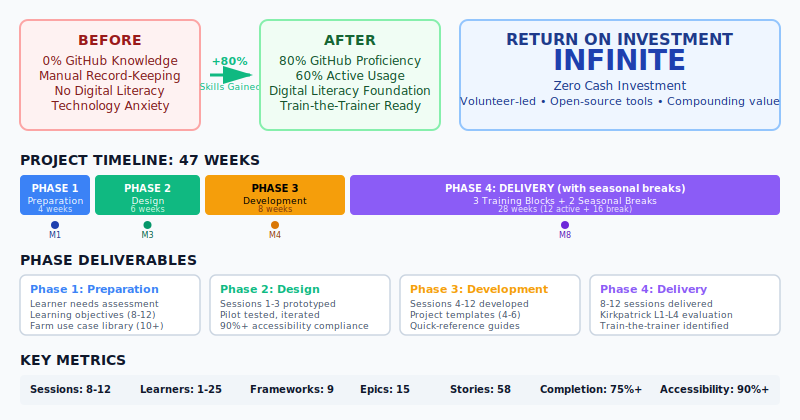

# GitHub Training Curriculum for Farmers

> Enabling farmers with no technical experience to adopt GitHub for farm data management, team collaboration, and digital literacy through accessible, hands-on training.

   -purple)

## Project Overview

<picture>
  <source media="(prefers-color-scheme: dark)" srcset=".github/readme-infographic.svg">
  
</picture>

## Problem

Farmers with zero GitHub or version control experience lack structured pathways to learn modern collaboration tools, resulting in missed opportunities for organized project tracking, automated workflows, and digital literacy. This gap manifests as:

| Metric | Current State | Target State | Improvement |
|--------|--------------|--------------|-------------|
| GitHub Proficiency | 0% (no knowledge) | 80% demonstrate independent skills | +80 percentage points |
| Training Completion Rate | N/A | 75% complete 8+ sessions | Industry top quartile |
| Sustained Usage (60 days) | 0% | 60% actively using GitHub | +60 percentage points |
| Farm Productivity Impact | 0 documented cases | 3+ documented improvements | Measurable operational gains |

## Approach

```mermaid
graph LR
    A[Phase 1: Preparation<br/>4 weeks] -->|Learning objectives,<br/>farm use cases| B[Phase 2: Design<br/>6 weeks]
    B -->|Prototype 3 sessions,<br/>pilot test| C[Phase 3: Development<br/>8 weeks]
    C -->|Build 8-12 sessions,<br/>accessibility compliance| D[Phase 4: Delivery<br/>28 weeks]
    D -->|In-person training,<br/>seasonal breaks| E[Outcome: Digital Literacy]

    style A fill:#3b82f6,stroke:#1e40af,color:#fff
    style B fill:#10b981,stroke:#059669,color:#fff
    style C fill:#f59e0b,stroke:#d97706,color:#000
    style D fill:#8b5cf6,stroke:#6d28d9,color:#fff
    style E fill:#10b981,stroke:#059669,color:#fff
```



**Instructional Design:** SAM (Successive Approximation Model) for rapid iteration, Kolb's Experiential Learning Cycle for hands-on delivery, UDL (Universal Design for Learning) for accessibility, Kirkpatrick Model for 4-level evaluation.

**Key Features:**
- 8-12 in-person training sessions spanning 3 blocks (March-April, July-Aug, Nov-Dec)
- Modular curriculum design accommodating agricultural seasonal breaks
- 90%+ accessibility compliance (WCAG 2.2 Level AA, Section 508)
- Farm-relevant scenarios: planting schedules, equipment tracking, grant compliance
- Zero budget volunteer effort using GitHub Free tier

## Frameworks Applied

| Framework | Application | Citation |
|-----------|-------------|----------|
| **ADDIE Model** | Systematic instructional design (Analysis, Design, Development, Implementation, Evaluation) | [ATD](https://www.td.org/insights/addie-model) |
| **Bloom's Taxonomy** | Learning objectives progression (Remember → Create) | [Vanderbilt CFT](https://cft.vanderbilt.edu/guides-sub-pages/blooms-taxonomy/) |
| **Kirkpatrick Model** | 4-level training evaluation (Reaction, Learning, Behavior, Results) | [Kirkpatrick Partners](https://kirkpatrickpartners.com/the-kirkpatrick-model/) |
| **Universal Design for Learning (UDL)** | Accessibility and inclusive design | [CAST UDL Guidelines](https://udlguidelines.cast.org/) |
| **Andragogy** | Adult learning principles (self-directed, problem-centered) | [Knowles 1984](https://eric.ed.gov/?id=ED084368) |
| **Cognitive Load Theory (CLT)** | Managing learner mental effort through chunking | [Sweller 1988](https://doi.org/10.1007/BF01320114) |
| **SAM (Successive Approximation)** | Agile curriculum development via rapid prototyping | [Allen Interactions](https://www.alleninteractions.com/sam-process) |
| **Kolb's Experiential Learning** | Hands-on learning cycle (Experience → Reflect → Conceptualize → Apply) | [Kolb 1984](https://www.simplypsychology.org/learning-kolb.html) |
| **Agricultural Extension Education** | Farmer-focused train-the-trainer approach | [USDA NIFA](https://www.nifa.usda.gov/about-nifa/how-we-work/extension) |

## Financial Impact

| Category | Value | Notes |
|----------|-------|-------|
| **Development Cost** | $0 (volunteer) | ~100-150 hours curriculum development; 24-36 hours delivery |
| **Delivery Cost** | $0 (volunteer) | In-person sessions; GitHub Free tier |
| **Annual Value** | Qualitative | Time savings, improved collaboration, compliance enablement, digital literacy |
| **3-Year ROI** | Infinite | Zero cash investment; compounding value through train-the-trainer scaling |
| **Key Drivers** | Volunteer model, open-source tools, transferable skills, peer training network | Farm productivity gains measured post-training (Kirkpatrick Level 4) |

**Impact Projection:**
- **Year 1:** 1-25 farmers gain GitHub proficiency and digital literacy foundation
- **Year 2:** First cohort habitual users; train-the-trainer reduces instructor burden; 25-50 total trained
- **Year 3:** Multiple cohorts via peer network; documented farm productivity improvements; community transformation

## Project Artifacts

### Planning & Governance

| Document | Description |
|----------|-------------|
| [PROJECT-CONTEXT.md](./PROJECT-CONTEXT.md) | Problem statement, stakeholders, constraints, desired outcomes |
| [PROJECT-PLAN.md](./PROJECT-PLAN.md) | Executive summary, 4-phase timeline, ROI analysis, immediate next steps |
| [JIRA-STRUCTURE.md](./JIRA-STRUCTURE.md) | 15 epics, 58 user stories, sprint planning, ~240 story points |
| [DEPENDENCY-ANALYSIS.md](./DEPENDENCY-ANALYSIS.md) | Critical path analysis, bottleneck identification, parallel work tracks |
| [RACI-CHART.md](./RACI-CHART.md) | Responsibility matrix, decision authority, single-person team adaptations |
| [RISK-REGISTER.md](./RISK-REGISTER.md) | 13 risks with mitigation strategies (technology anxiety, seasonal conflicts, accessibility) |
| [SEVERITY-CLASSIFICATION.md](./SEVERITY-CLASSIFICATION.md) | Priority framework, escalation procedures, issue triage |

### Measurement & Quality

| Document | Description |
|----------|-------------|
| [SUCCESS-METRICS.md](./SUCCESS-METRICS.md) | Kirkpatrick 4-level KPIs, dashboard specification, closure criteria |
| [BEST-PRACTICES.md](./_research/BEST-PRACTICES.md) | 9 framework applications with industry benchmarks and citations |
| [DOMAIN-RESEARCH.md](./_research/DOMAIN-RESEARCH.md) | Industry classification, terminology, compliance requirements, benchmarks |
| [RUNBOOK-TEMPLATE.md](./RUNBOOK-TEMPLATE.md) | Operational procedures, troubleshooting, session facilitation scripts |

### Visualizations

| Asset | Description |
|-------|-------------|
| [GANTT-CHART.md](./GANTT-CHART.md) | 47-week timeline with critical path, dependency matrix, milestones |
| [.github/gantt-chart.svg](./.github/gantt-chart.svg) | SVG Gantt chart visualization (blue/green/amber/purple phases) |
| [.github/readme-infographic.svg](./.github/readme-infographic.svg) | Project overview infographic with key metrics |

### Executive Materials

| Document | Description |
|----------|-------------|
| [workspace/slides/](./workspace/slides/) | 8 HTML executive briefing slides (cover, problem, approach, timeline, governance, metrics, outcomes, next steps) |
| [workspace/build-deck.js](./workspace/build-deck.js) | Build script for generating PowerPoint deck from HTML |
| [CHANGELOG.md](./CHANGELOG.md) | Version history of all planning artifacts |

## Team Structure

| Role | Responsibility | RACI Code |
|------|---------------|-----------|
| **Curriculum Developer/Instructor** | Solo project owner: research, design, development, delivery, evaluation | R/A (all activities) |
| **Farmer Learners (1-25)** | Primary participants: provide feedback, complete exercises, participate in assessments | C/I (consulted for needs, informed of progress) |
| **Agricultural Extension Expert** | Optional consultant: domain expertise on farming practices, training methods | C (consulted for scenarios) |
| **Accessibility Consultant** | Optional consultant: ADA/Section 508/WCAG compliance review | C (consulted for audits) |
| **Peer Mentor** | High-performing learner: assists peers, progresses to train-the-trainer | R (delivery support, emerging role) |

## Timeline Highlights

| Milestone | Week | Deliverable |
|-----------|------|-------------|
| **M1: Project Kickoff** | Week 1 | Planning artifacts published; learner needs survey distributed |
| **M2: Curriculum Design Complete** | Week 4 | Learning objectives for 8-12 sessions; session template; accessibility checklist |
| **M3: Prototype Validated** | Week 10 | Sessions 1-3 developed, pilot tested, 90%+ accessibility compliance |
| **M4: All Content Developed** | Week 18 | Sessions 1-12 complete; project templates; guides; final accessibility audit |
| **M5: Delivery Ready** | Week 19 | Demo environment; logistics confirmed; feedback surveys ready |
| **M6: Block 1 Complete** | Week 23 | Sessions 1-4 delivered; 75%+ attendance; evaluation data collected |
| **Planting Break** | Weeks 24-31 | No sessions; asynchronous resources provided |
| **M7: Block 2 Complete** | Week 35 | Sessions 5-8 delivered; post-break engagement sustained |
| **Harvest Break** | Weeks 36-43 | No sessions; optional check-ins |
| **M8: Training Complete** | Week 47 | Sessions 9-12 delivered; capstone projects; 60%+ active usage; 3+ farm impact stories |
| **M9: Train-the-Trainer Ready** | Week 52 | Lessons learned documented; 1+ candidate coached; curriculum iterated |

## Build Commands

Generate visual assets from workspace sources:

```bash
cd workspace && npm install
node generate-assets.js   # Generate PNG assets from HTML slides
node build-deck.js        # Build executive PowerPoint deck
```

## Quick Start for Using This Curriculum

1. **Review Planning Artifacts:** Start with [PROJECT-CONTEXT.md](./PROJECT-CONTEXT.md) and [PROJECT-PLAN.md](./PROJECT-PLAN.md)
2. **Understand Constraints:** Review seasonal scheduling in [GANTT-CHART.md](./GANTT-CHART.md)
3. **Prepare for Risks:** Consult [RISK-REGISTER.md](./RISK-REGISTER.md) for technology anxiety, accessibility, attrition mitigation
4. **Track Progress:** Use [SUCCESS-METRICS.md](./SUCCESS-METRICS.md) to measure Kirkpatrick L1-L4 outcomes
5. **Follow Workflows:** Reference [RUNBOOK-TEMPLATE.md](./RUNBOOK-TEMPLATE.md) for session facilitation scripts

## License

MIT - See [LICENSE](./LICENSE)

---

**Document Version:** 1.0
**Last Updated:** 2026-01-30
**Project Owner:** Curriculum Developer/Instructor
