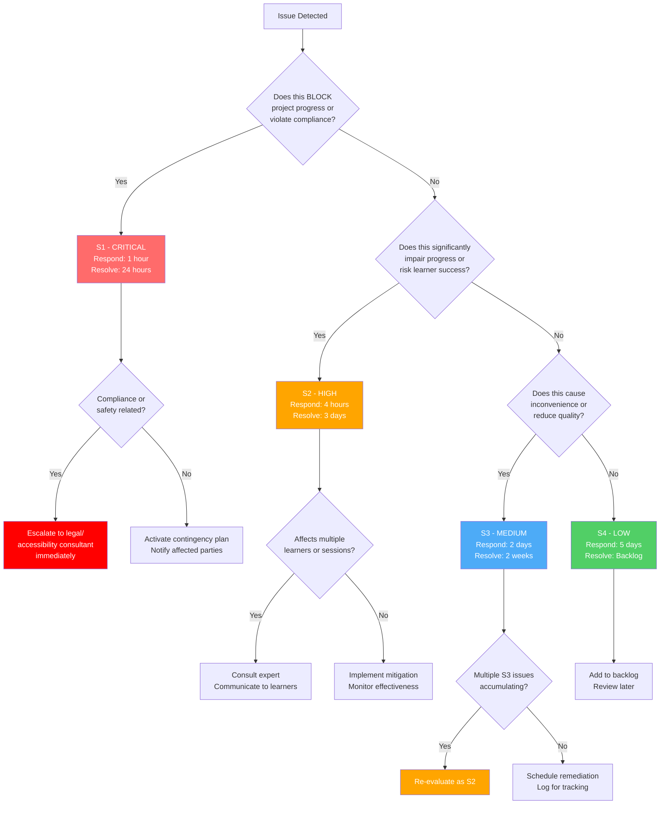
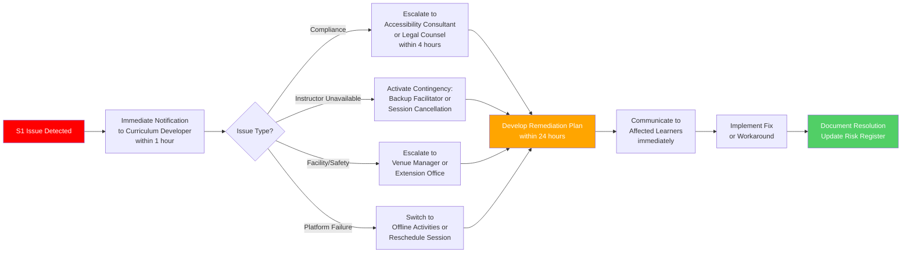

# Severity Classification: GitHub Training Curriculum for Farmers

## Overview

This document defines severity levels for issues, risks, and incidents arising during the GitHub training curriculum project. The classification framework ensures consistent prioritization, appropriate response times, and clear escalation procedures adapted for a single-person development team delivering training to non-technical learners.

**Context:** This is an educational project with accessibility compliance requirements, seasonal scheduling constraints, and learners progressing from zero technical knowledge to independent GitHub proficiency.

---

## Classification Levels

### S1 - Critical (Blocker)

**Definition:** Issues that completely prevent project progress, violate compliance requirements, or exclude learners from participation. Immediate action required.

**Response Time SLA:** Immediate (within 1 hour of detection)

**Resolution Target:** 24 hours or provide workaround within 4 hours

**Notification Channel:**
- Primary: Direct communication to Curriculum Developer (project owner)
- Secondary: Notification to affected learners, accessibility consultant if applicable

**Examples:**
1. **Accessibility Compliance Violation**: Training materials fail ADA/Section 508/WCAG 2.2 Level AA audit and exclude learners with disabilities from accessing content
2. **Instructor Unavailability (Extended)**: Curriculum Developer unable to deliver sessions due to illness/emergency lasting >2 weeks with no backup facilitator identified
3. **Complete Platform Failure**: GitHub.com is down or inaccessible during scheduled training session, preventing all hands-on practice
4. **Facility Unavailable**: Training venue is suddenly unavailable (e.g., building closure, emergency) on session day with no alternative location
5. **Critical Safety Issue**: Training environment poses physical safety risk to learners (e.g., facility hazard, COVID outbreak)
6. **Data Privacy Breach**: Learner personal information or training data exposed or compromised

**Escalation Path:**
1. Immediate notification to project owner (Curriculum Developer)
2. If compliance-related, escalate to legal counsel or accessibility consultant within 4 hours
3. If facility-related, escalate to venue manager/agricultural extension office immediately
4. If instructor unavailability, activate contingency plan (backup facilitator, session cancellation, asynchronous delivery)

---

### S2 - High (Major Impact)

**Definition:** Issues that significantly impair project progress, risk learner success, or threaten key objectives. Require urgent attention but workarounds may exist.

**Response Time SLA:** 4 hours (same business day)

**Resolution Target:** 3 business days

**Notification Channel:**
- Primary: Curriculum Developer task tracking (JIRA/GitHub Issues)
- Secondary: Notification to affected learners if session-impacting

**Examples:**
1. **High Learner Attrition**: >25% of learners drop out by mid-program (Session 6), threatening cohort viability and project success metrics
2. **Widespread Cognitive Overload**: >40% of learners show confusion/frustration in formative assessments, indicating curriculum pacing or complexity issues
3. **Seasonal Scheduling Conflict**: Major conflict emerges (e.g., early planting season) forcing rescheduling of 2+ sessions with <2 weeks notice
4. **Critical Content Error**: Major inaccuracy in training materials (e.g., incorrect instructions causing learners to delete repositories, wrong terminology)
5. **Device Incompatibility**: Lab exercises fail on >30% of learners' devices (e.g., mobile GitHub interface issues), preventing participation
6. **Accessibility Partial Failure**: 60-80% of materials pass accessibility audit; requires remediation to meet 90% target before delivery
7. **Instructor Burnout Warning**: Curriculum Developer shows burnout symptoms (exhaustion, resentment, missing deadlines), risking project completion
8. **Key Delivery Failure**: Session materials incomplete or missing on session day (e.g., slides not finished, lab exercises not tested)

**Escalation Path:**
1. Curriculum Developer assesses impact and mitigation options within 4 hours
2. If attrition/cognitive overload, consult agricultural extension expert for instructional adjustments
3. If accessibility, consult accessibility specialist for remediation guidance
4. If burnout, implement workload reduction and timeline extension immediately
5. Communicate mitigation plan to learners within 24 hours if session-impacting

---

### S3 - Medium (Moderate Impact)

**Definition:** Issues that cause inconvenience, reduce quality, or slow progress but do not block critical activities. Should be addressed soon but can be scheduled.

**Response Time SLA:** 2 business days

**Resolution Target:** 2 weeks

**Notification Channel:**
- Primary: Curriculum Developer task tracking
- Secondary: Notification to learners only if directly affects their experience

**Examples:**
1. **Moderate Knowledge Decay**: Post-break recap session shows 40-60% skill retention (lower than ideal but recoverable with additional review)
2. **Minor Accessibility Issues**: 80-90% accessibility compliance; minor issues like inconsistent alt text quality, some contrast ratio near minimum
3. **Session Timing Overruns**: Sessions consistently run 15-30 minutes over planned time, requiring schedule adjustments
4. **Limited Device Access**: 10-25% of learners using suboptimal devices (smartphones) but can participate with accommodations
5. **Content Quality Issues**: Materials functional but could be improved (e.g., unclear instructions, low-quality visuals, typos)
6. **Moderate Learner Confusion**: 20-40% of learners struggle with specific concept but majority progressing
7. **Farm Scenario Relevance Gap**: Some lab exercises don't resonate with learners' specific farming contexts (crops vs. livestock)
8. **Feedback Survey Low Response**: <60% of learners completing session feedback surveys, reducing evaluation data quality
9. **Peer Mentor Not Emerging**: No high-performing learners identified for peer mentor role by Session 6 (stretch goal at risk)
10. **Internet Connectivity Issues**: Intermittent Wi-Fi issues during sessions, slowing exercises but not preventing completion

**Escalation Path:**
1. Curriculum Developer logs issue and schedules remediation within sprint (2 weeks)
2. If instructional quality issue, consult agricultural extension expert for improvements
3. If multiple S3 issues accumulate (5+), escalate collectively to S2 priority
4. Communicate improvements to learners in next session announcement

---

### S4 - Low (Minor Impact)

**Definition:** Issues that have minimal impact on project success. Nice-to-fix improvements, suggestions, or cosmetic issues. Address as time permits.

**Response Time SLA:** 5 business days (acknowledge)

**Resolution Target:** Next cohort or backlog

**Notification Channel:**
- Primary: Curriculum Developer backlog/parking lot
- Secondary: None

**Examples:**
1. **Visual Polish**: Slide design inconsistencies, branding improvements, color scheme adjustments
2. **Optional Feature Requests**: Learner requests for out-of-scope topics (e.g., "Can we learn GitHub Pages?")
3. **Documentation Typos**: Minor spelling/grammar errors in handouts or guides that don't affect comprehension
4. **Stretch Goal Features**: Train-the-trainer coaching, advanced automation topics, GitHub Spark/Agents if not core to MVP
5. **Process Improvements**: Suggestions for better session structure, alternative facilitation techniques to try next cohort
6. **GitHub Feature Updates**: Minor UI changes that don't affect learning objectives (e.g., button moved slightly)
7. **Nice-to-Have Resources**: Additional quick-reference guides, supplemental videos, bonus practice exercises
8. **Subjective Preferences**: Individual learner preferences (e.g., "Can we use different farm examples?") that don't affect others
9. **Post-Training Enhancement Ideas**: Suggestions for follow-up advanced curriculum, community events, alumni network
10. **Reporting Improvements**: Enhancements to evaluation dashboards, data visualizations, or reporting formats

**Escalation Path:**
1. Log in backlog/parking lot for future consideration
2. No immediate action required
3. Review during retrospective or next cohort planning
4. If multiple learners request same S4 feature, consider promoting to S3

---

## Decision Tree: How to Classify an Issue

---

## Routing Rules

| Severity | Primary Channel | Secondary Channel | Escalation Trigger | Response Owner |
|----------|----------------|-------------------|-------------------|----------------|
| **S1** | Direct to Curriculum Developer (phone/text/email immediate) | Accessibility Consultant (compliance), Extension Office (facility) | Immediate upon detection | Curriculum Developer (A) + External Expert (C) |
| **S2** | JIRA/GitHub Issues tagged `priority:high` + Email | Learner notification (if session-impacting) | If unresolved within 3 days | Curriculum Developer (A) |
| **S3** | JIRA/GitHub Issues tagged `priority:medium` | Learner notification (if quality-impacting) | If 5+ S3 issues accumulate | Curriculum Developer (A) |
| **S4** | Backlog/Parking Lot document | None | If requested by multiple learners | Curriculum Developer (review only) |

---

## Classification Examples

| Scenario | Classification | Rationale |
|----------|---------------|-----------|
| Training materials lack captions on videos; learner with hearing impairment cannot access content | **S1 - Critical** | ADA/Section 508 compliance violation; excludes learner from participation; legal risk |
| Instructor has flu and misses Session 3; no backup facilitator available | **S2 - High** | Significant schedule disruption; affects all learners; workaround exists (reschedule) |
| 30% of learners report Session 5 was "too fast" in feedback survey | **S2 - High** | Cognitive overload indicator; risks attrition and learning outcomes; requires pacing adjustment |
| Lab exercise instructions say "click New Issue" but button is now labeled "Create Issue" due to GitHub UI update | **S3 - Medium** | Causes confusion but learners can infer correct action; should update materials soon |
| Slide deck uses inconsistent fonts across sessions | **S4 - Low** | Cosmetic issue; doesn't affect learning; fix in next iteration |
| Learner requests "Can we also learn GitHub Copilot Workspaces?" | **S4 - Low** | Out-of-scope feature request; nice-to-have; add to parking lot for advanced curriculum |
| 50% of learners miss Session 8 due to early harvest season | **S1 - Critical** | Major schedule conflict affecting half the cohort; requires immediate rescheduling and communication |
| Recap session after planting break shows 35% skill retention (lower than 60% target) | **S3 - Medium** | Knowledge decay higher than ideal but recoverable; extend recap session |
| Learner cannot complete exercise on smartphone because file upload doesn't work on mobile GitHub | **S2 - High** | Device incompatibility prevents participation; affects 20-30% of learners using phones; requires workaround or device accommodation |
| Session feedback shows 85% learner satisfaction (below 90% target) | **S3 - Medium** | Below target but not critical; investigate and address top concerns |
| Facilitator guide missing troubleshooting section for Session 7 | **S3 - Medium** | Reduces session delivery quality; instructor can improvise but should add for next cohort |
| Learner suggests using a different farm scenario in Session 4 exercise | **S4 - Low** | Subjective preference; current scenario works; note for future consideration |

---

## Escalation Procedures

### S1 Critical Escalation

**Escalation Timeline:**
- **0-1 hour:** Issue detected and Curriculum Developer notified
- **1-4 hours:** Assess severity, identify root cause, determine escalation path
- **4-8 hours:** Engage external experts (accessibility consultant, extension office, backup facilitator)
- **8-24 hours:** Develop and communicate remediation plan to learners
- **24-48 hours:** Implement fix or workaround; monitor effectiveness

### S2 High Escalation

**Trigger:** Issue unresolved within 3 business days OR affects >40% of learners OR risks project objective

**Process:**
1. Curriculum Developer re-assesses issue severity (still S2 or promote to S1?)
2. Consult relevant expert:
   - Instructional issues → Agricultural Extension Expert
   - Accessibility issues → Accessibility Consultant
   - Technical issues → GitHub documentation, community forums
3. Develop mitigation plan with timeline
4. Communicate plan to affected learners within 24 hours of escalation
5. Implement plan within 1 week
6. Monitor and iterate if ineffective

### S3 Medium Escalation

**Trigger:** 5+ S3 issues accumulate in same category (e.g., 5 cognitive load issues) OR S3 issue persists >2 weeks without progress

**Process:**
1. Curriculum Developer reviews cluster of S3 issues collectively
2. Determine if cluster represents broader S2 problem (e.g., systemic instructional design flaw)
3. If yes, promote to S2 and follow S2 escalation process
4. If no, prioritize within backlog and schedule for next sprint

### S4 Low Escalation

**Trigger:** S4 issue requested by 3+ learners OR identified as quick win during retrospective

**Process:**
1. Curriculum Developer reviews S4 backlog monthly
2. Promote high-value, low-effort S4 issues to S3 for next cohort
3. Defer remaining S4 issues to future enhancements

---

## Severity Reclassification Guidelines

Issues may be reclassified as new information emerges or circumstances change.

**Promote Severity (Escalate):**
- S4 → S3: Multiple learners request same feature; quick win identified
- S3 → S2: Issue affects more learners than initially thought; resolution more difficult than expected
- S2 → S1: Issue blocks critical path; learners unable to participate; compliance violation discovered
- Any → S1: New information reveals safety, legal, or exclusion risk

**Demote Severity (De-escalate):**
- S1 → S2: Workaround implemented successfully; no longer blocking
- S2 → S3: Fewer learners affected than thought; impact less severe
- S3 → S4: Issue resolves itself (e.g., GitHub UI change reverts); cosmetic only

**Reclassification Process:**
1. Curriculum Developer assesses new information
2. Documents rationale for severity change
3. Updates issue tracking system (JIRA/GitHub)
4. Adjusts response timeline and routing accordingly
5. Communicates reclassification if affects learners or external stakeholders

---

## Governance

### Quarterly Review Process

**Frequency:** Every 3 months during project; annually post-delivery

**Participants:** Curriculum Developer, optional Agricultural Extension Expert for lessons learned

**Agenda:**
1. Review severity classification effectiveness:
   - Were issues classified correctly?
   - Were response SLAs met?
   - Were escalation procedures followed?
2. Analyze severity distribution:
   - Trends: Are certain issue types increasing?
   - Root causes: What systemic issues are generating S1/S2 incidents?
3. Update classification criteria if needed:
   - Add new examples based on real issues encountered
   - Adjust SLAs based on actual resolution times
   - Refine decision tree based on confusion points
4. Incorporate lessons learned into next cohort planning

**Outputs:**
- Updated SEVERITY-CLASSIFICATION.md document
- Recommendations for risk mitigation (feed into RISK-REGISTER.md)
- Training for next cohort facilitators on severity handling

### Issue Tracking Integration

**JIRA/GitHub Labels:**
- `severity:critical` (S1) - Red
- `severity:high` (S2) - Orange
- `severity:medium` (S3) - Blue
- `severity:low` (S4) - Green

**Required Fields for S1/S2 Issues:**
- **Detected Date:** When issue was first identified
- **Reported By:** Learner, instructor, automated audit, etc.
- **Impact:** How many learners/sessions affected
- **Mitigation Status:** In Progress, Workaround Implemented, Resolved
- **Resolution Date:** When issue closed
- **Lessons Learned:** What to do differently next time

---

## Severity Metrics & Reporting

### Key Metrics

| Metric | Target | Measurement |
|--------|--------|-------------|
| **S1 Critical Issues** | 0 per project | Count of S1 issues logged |
| **S1 Response Time** | 100% within 1 hour | % of S1 issues acknowledged within SLA |
| **S1 Resolution Time** | 90% within 24 hours | % of S1 issues resolved or workaround within SLA |
| **S2 High Issues** | <5 per phase | Count of S2 issues per project phase |
| **S2 Resolution Rate** | 85% within 3 days | % of S2 issues resolved within SLA |
| **S3 Medium Issues** | <15 per project | Count of S3 issues logged |
| **S3 Accumulation** | No clusters of 5+ | Monitor for systemic S3 patterns |
| **Severity Accuracy** | 90% correct classification | % of issues not requiring reclassification |

### Dashboard (Monthly During Delivery)

**Open Issues by Severity:**
- S1: [Count] - RED ALERT if >0
- S2: [Count] - WARNING if >3
- S3: [Count] - MONITOR if >10
- S4: [Count] - Backlog

**Resolution Trends:**
- Average S1 resolution time: [Hours]
- Average S2 resolution time: [Days]
- % issues resolved within SLA: [Percentage]

**Top Issue Categories:**
- Accessibility: [Count]
- Cognitive Load: [Count]
- Device/Infrastructure: [Count]
- Scheduling: [Count]
- Content Quality: [Count]

---

## Training Delivery Scenarios & Severity Mapping

### Scenario 1: Learner with Disability Unable to Access Materials

**Issue:** Learner discloses visual impairment; materials lack screen reader compatibility

**Classification:** S1 - Critical (ADA/Section 508 violation; learner exclusion)

**Response:**
1. Immediate: Apologize, provide alternative format (large print, 1:1 verbal instruction)
2. Within 4 hours: Engage accessibility consultant to audit materials
3. Within 24 hours: Remediate materials (add alt text, improve screen reader compatibility)
4. Within 48 hours: Test with learner to confirm accessibility
5. Document lesson learned; apply to all future materials

**Escalation:** Legal counsel if compliance risk; disability services office for accommodation support

---

### Scenario 2: Session Materials Not Ready 2 Hours Before Delivery

**Issue:** Instructor behind on Session 5 slide deck; lab exercises not tested

**Classification:** S2 - High (delivery quality at risk; learners expecting prepared session)

**Response:**
1. Within 2 hours: Assess what can be salvaged; prioritize hands-on practice over slides
2. Notify learners: "Today's session will focus on practice; slides will be lighter"
3. Deliver session with emphasis on demonstration and guided practice
4. Complete materials within 3 days; send to learners for review
5. Document cause (burnout? scope creep?) and adjust workload/timeline

**Escalation:** If recurring issue, escalate to burnout risk mitigation (R-010)

---

### Scenario 3: 40% of Learners Report "Too Fast" After Session 4

**Issue:** Cognitive overload detected via feedback survey

**Classification:** S2 - High (learning outcomes at risk; widespread issue)

**Response:**
1. Within 4 hours: Review Session 4 content and pacing
2. Within 24 hours: Plan Session 5 adjustments (slower pace, more review, simplified content)
3. Session 5 opening: Acknowledge feedback, review Session 4 key concepts before new material
4. Ongoing: Monitor cognitive load in subsequent sessions; adjust pacing
5. Revise Session 4 materials for next cohort

**Escalation:** Consult agricultural extension expert for adult learning strategies

---

### Scenario 4: Early Planting Season Conflicts with Session 7-8

**Issue:** Weather causes early planting; 60% of learners unavailable for scheduled sessions

**Classification:** S1 - Critical (major schedule disruption affecting majority of cohort)

**Response:**
1. Immediate: Survey learners to confirm availability
2. Within 4 hours: Reschedule Sessions 7-8 to post-planting period (June)
3. Within 24 hours: Communicate revised schedule to all learners
4. Provide asynchronous resources (videos, guides) to maintain momentum
5. Add recap session when resuming to address knowledge decay

**Escalation:** None required (operational issue handled by instructor); document for next cohort seasonal planning

---

### Scenario 5: Instructor Diagnosed with Illness Requiring 3-Week Recovery

**Issue:** Curriculum Developer unable to deliver Sessions 9-10; no backup facilitator

**Classification:** S1 - Critical (single point of failure; project continuation at risk)

**Response:**
1. Immediate: Notify learners of instructor absence; apologize for disruption
2. Within 4 hours: Assess options:
   - Option A: Pause delivery 3 weeks (extend timeline)
   - Option B: Activate backup facilitator (if available)
   - Option C: Shift to asynchronous completion (learners work independently)
3. Within 24 hours: Communicate plan to learners; provide resources for chosen option
4. Upon return: Offer makeup sessions, one-on-one catch-up, or integration into next cohort

**Escalation:** Extension office for backup facilitator; learners for timeline extension approval

---

## Cross-Reference to Project Artifacts

- **RISK-REGISTER.md**: Risk impacts map to severity levels (High impact risks → S1/S2 issues)
- **RACI-CHART.md**: Decision Authority Matrix defines escalation owners for each severity
- **PROJECT-PLAN.md**: Risk Management Summary references severity classification for prioritization
- **JIRA-STRUCTURE.md**: Severity labels integrated into issue tracking workflow
- **BEST-PRACTICES.md**: Framework violations (e.g., UDL non-compliance) trigger S1/S2 classification

---

**Document Version:** 1.0
**Last Updated:** 2026-01-30
**Owner:** Curriculum Developer/Instructor
**Review Cadence:** Quarterly during project; annually post-delivery
**Next Review:** 2026-04-30
