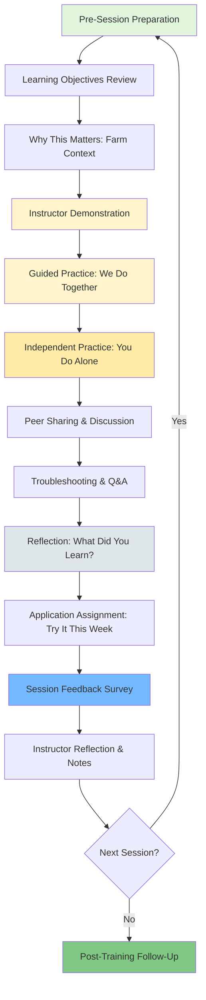

# Best Practices: GitHub Training Curriculum for Agricultural Workers

## Overview

This document applies best practices from 9 authoritative frameworks to the development and delivery of a GitHub training curriculum for farmers with no technical experience. Each framework's principles are mapped to specific project activities, epics, and implementation strategies.

---

## Framework 1: ADDIE Model (Florida State University, 1970s)

**Source:** [Instructional Design Models for 2026: ADDIE, Gagne's, Merrill's and Bloom's Methodologies - Research.com](https://research.com/education/instructional-design-models)

**Key Principles:**
- **Analysis** - Identify learner characteristics, needs, existing knowledge, and constraints
- **Design** - Define learning objectives, assessment instruments, content structure, and delivery methods
- **Development** - Create and assemble instructional materials, exercises, and assessments
- **Implementation** - Deliver training to learners in the intended environment
- **Evaluation** - Assess training effectiveness and identify improvements (formative and summative)

**Application to This Project:**

| Principle | Applied In | Epic IDs |
|-----------|-----------|----------|
| **Analysis** | Learner needs assessment: survey farmers' technology access, digital literacy baseline, seasonal availability, learning preferences | Epic 1: Project Initiation & Research |
| **Design** | Create session-by-session learning objectives using Bloom's Taxonomy; design hands-on lab exercises; plan accessibility features | Epic 2: Curriculum Design & Planning |
| **Development** | Build slide decks, lab worksheets, quick-reference guides, farming-specific project templates, video demonstrations | Epic 3: Content Development |
| **Implementation** | Deliver 8-12 in-person training sessions with hands-on practice; provide facilitator-led demonstrations and guided exercises | Epic 4: Training Delivery |
| **Evaluation** | Collect session feedback (Kirkpatrick L1), assess knowledge via demonstrations (L2), monitor GitHub usage (L3), measure farm productivity improvements (L4) | Epic 5: Assessment & Iteration |

**Rationale for Inclusion:**
ADDIE provides the foundational systematic approach for instructional design, ensuring all curriculum development phases are addressed with rigor. Its iterative evaluation phase aligns with the project's volunteer-led, continuous improvement context.

---

## Framework 2: Bloom's Taxonomy - Revised (Anderson & Krathwohl, 2001)

**Source:** [Bloom's Taxonomy in Instructional Design: A Practical Guide - CommLab India](https://www.commlabindia.com/blog/blooms-taxonomy-in-instructional-design)

**Key Principles:**
- **Remember** - Recall facts and basic concepts (recognize, list, describe)
- **Understand** - Explain ideas or concepts (summarize, classify, explain)
- **Apply** - Use information in new situations (execute, implement, solve)
- **Analyze** - Draw connections among ideas (differentiate, organize, attribute)
- **Evaluate** - Justify a decision or course of action (check, critique, judge)
- **Create** - Produce new or original work (design, construct, produce)

**Application to This Project:**

| Principle | Applied In | Epic IDs |
|-----------|-----------|----------|
| **Remember** | Session 1-2: Define repository, issue, commit, project board; identify GitHub interface elements | Epic 3: Content Development (Sessions 1-2) |
| **Understand** | Session 3-4: Explain how issues track tasks; summarize project board workflows; describe collaboration roles | Epic 3: Content Development (Sessions 3-4) |
| **Apply** | Session 5-6: Create a repository for a farm project; implement a project board for planting schedule; execute issue assignment | Epic 3: Content Development (Sessions 5-6) |
| **Analyze** | Session 7-8: Compare different project board views; organize issues by priority; differentiate when to use Actions vs manual processes | Epic 3: Content Development (Sessions 7-8) |
| **Evaluate** | Session 9-10: Critique peer GitHub projects; assess which workflows best fit farm operations; judge automation ROI | Epic 3: Content Development (Sessions 9-10) |
| **Create** | Session 11-12: Design a complete farm management system in GitHub; construct custom Actions workflow; train a peer farmer | Epic 3: Content Development (Sessions 11-12) |

**Rationale for Inclusion:**
Bloom's Taxonomy structures the curriculum as a progressive skill-building journey from basic recall (Session 1: "What is a repository?") to advanced creation (Session 12: "Build your own farm project from scratch"). This prevents cognitive overload and ensures mastery before advancing.

---

## Framework 3: Andragogy - Malcolm Knowles' Adult Learning Theory (1960s)

**Source:** [The Andragogy Approach: Knowles' Adult Learning Theory Principles for 2026 - Research.com](https://research.com/education/the-andragogy-approach)

**Key Principles:**
1. **Need to Know** - Adults need to understand why they are learning something before committing
2. **Learner's Experience** - Adults' experiences form the foundation for learning activities
3. **Self-Concept** - Adults are responsible, self-directed learners
4. **Readiness to Learn** - Adults are ready to learn when the content solves an immediate problem
5. **Orientation to Learning** - Adults are problem-centered rather than content-centered
6. **Motivation** - Adults are intrinsically motivated by personal growth and autonomy

**Application to This Project:**

| Principle | Applied In | Epic IDs |
|-----------|-----------|----------|
| **Need to Know** | Every session begins with "Why this matters for your farm" - concrete examples of how GitHub solves real farm problems (lost records, miscommunication, compliance tracking) | Epic 3: Content Development (all sessions) |
| **Learner's Experience** | Labs use farm scenarios learners recognize: planting schedules, livestock health tracking, equipment maintenance, grant reporting | Epic 3: Content Development (lab design) |
| **Self-Concept** | Learners choose their own farm project to build throughout the curriculum; optional advanced topics based on interest | Epic 2: Curriculum Design (modular structure) |
| **Readiness to Learn** | Schedule sessions to address immediate seasonal needs (e.g., "Track planting tasks" in spring, "Document harvest" in fall) | Epic 1: Project Initiation (seasonal scheduling) |
| **Orientation to Learning** | Sessions focus on completing tasks ("Create an issue for a broken fence") rather than theory ("Understanding issue metadata fields") | Epic 3: Content Development (problem-based approach) |
| **Motivation** | Emphasize autonomy (manage your own farm data), mastery (confidence with technology), purpose (better farm outcomes) | Epic 4: Training Delivery (facilitation approach) |

**Rationale for Inclusion:**
Adult farmers are not blank slates—they bring decades of agricultural expertise and problem-solving experience. Andragogy ensures the curriculum respects their autonomy, leverages their knowledge, and connects GitHub to problems they already care about solving, maximizing engagement and retention.

---

## Framework 4: Kirkpatrick Model of Training Evaluation (Donald Kirkpatrick, 1959)

**Source:** [Kirkpatrick Partners: What is The Kirkpatrick Model?](https://www.kirkpatrickpartners.com/the-kirkpatrick-model/)

**Key Principles:**
- **Level 1: Reaction** - Measure learner satisfaction, engagement, and perceived relevance
- **Level 2: Learning** - Assess knowledge and skill acquisition during training
- **Level 3: Behavior** - Evaluate whether learners apply new skills on the job
- **Level 4: Results** - Determine if training achieves organizational/business outcomes

**Application to This Project:**

| Principle | Applied In | Epic IDs |
|-----------|-----------|----------|
| **Level 1: Reaction** | End-of-session surveys: "Was this session valuable? Did you feel confident? Was the pacing appropriate?" | Epic 5: Assessment & Iteration (session feedback) |
| **Level 2: Learning** | Hands-on demonstrations during sessions: "Show me how to create an issue. Navigate to your project board. Assign a task to yourself." | Epic 5: Assessment & Iteration (formative assessments) |
| **Level 3: Behavior** | 30-day and 60-day follow-up: Track GitHub activity (repos created, issues managed, project boards used); interview farmers about integration into daily operations | Epic 5: Assessment & Iteration (post-training monitoring) |
| **Level 4: Results** | 6-month follow-up: Measure farm productivity improvements (time saved on record-keeping, reduced task confusion, improved team coordination, grant compliance achieved) | Epic 5: Assessment & Iteration (impact measurement) |

**Rationale for Inclusion:**
The Kirkpatrick Model provides a comprehensive evaluation framework moving from immediate reactions to long-term business impact. For a volunteer project, this validates effort and informs future iterations. Level 3 and 4 data also supports train-the-trainer scaling by demonstrating real-world value.

---

## Framework 5: Universal Design for Learning (UDL) - CAST (2002, updated 3.0 in 2024)

**Source:** [CAST Universal Design for Learning Guidelines](https://udlguidelines.cast.org/)

**Key Principles:**
- **Multiple Means of Representation** - Present information in varied formats (text, visual, audio, hands-on)
- **Multiple Means of Action & Expression** - Allow learners to demonstrate knowledge in different ways (verbal, written, demonstration, project)
- **Multiple Means of Engagement** - Provide choice and relevance to motivate diverse learners

**Application to This Project:**

| Principle | Applied In | Epic IDs |
|-----------|-----------|----------|
| **Multiple Means of Representation** | Deliver content via: live demonstration, slide decks with visuals, printed handouts, video walkthroughs, analogies to farming ("commits are like planting records") | Epic 3: Content Development (multimedia materials) |
| **Multiple Means of Action & Expression** | Allow learners to show understanding via: hands-on demonstrations, peer teaching, creating their own farm project, verbal explanations, written reflections | Epic 5: Assessment & Iteration (varied assessments) |
| **Multiple Means of Engagement** | Offer choice in practice scenarios (crops vs livestock vs equipment); pair learners for peer support; celebrate small wins; provide optional advanced topics | Epic 2: Curriculum Design (flexible pathways) |
| **Representation - Perception** | Use high-contrast slides, large fonts, alt text on images, captions on videos, screen reader-compatible materials | Epic 3: Content Development (accessibility features) |
| **Representation - Language/Symbols** | Avoid jargon; define technical terms; use consistent terminology from domain research; provide visual glossary | Epic 3: Content Development (language simplification) |
| **Engagement - Recruiting Interest** | Start with real farm challenges; use success stories from other farmers; connect to learners' goals | Epic 4: Training Delivery (motivational opening) |

**Rationale for Inclusion:**
UDL is critical for meeting ADA/Section 508 compliance while also improving learning outcomes for all participants. By designing for variability from the start (rather than retrofitting accommodations), the curriculum becomes more effective for learners with disabilities, varied tech literacy, different learning styles, and environmental constraints (e.g., noisy farm settings).

---

## Framework 6: SAM - Successive Approximation Model (Michael Allen, 2012)

**Source:** [SAM: A Rapid Design And Development Model - eLearning Industry](https://elearningindustry.com/sam-successive-approximation-model-for-rapid-instructional-design)

**Key Principles:**
- **Preparation** - Gather information, define project scope, assemble team
- **Iterative Design** - Create rapid prototypes, gather feedback, refine design
- **Iterative Development** - Build content in sprints, test with users, continuously improve
- **Collaboration** - Involve subject matter experts and learners throughout
- **Rapid Prototyping** - Favor working drafts over perfect final products early on

**Application to This Project:**

| Principle | Applied In | Epic IDs |
|-----------|-----------|----------|
| **Preparation** | Analyze project constraints (budget, timeline, team size); define success criteria; research existing GitHub training resources | Epic 1: Project Initiation & Research |
| **Iterative Design** | Prototype first 3 sessions with draft slides and lab exercises; test with 1-2 pilot learners if possible; revise based on feedback | Epic 2: Curriculum Design & Planning |
| **Iterative Development** | Develop curriculum in 3-session sprints; deliver early sessions while refining later sessions; incorporate learner feedback into subsequent sessions | Epic 3: Content Development |
| **Collaboration** | Consult with agricultural extension experts; involve early learners in co-design; seek accessibility review from disability services professionals | Epic 1-3: Stakeholder engagement |
| **Rapid Prototyping** | Create "good enough" materials quickly rather than perfecting Session 12 before starting Session 1; prioritize hands-on exercises over polished slides | Epic 2-3: Agile content creation |

**Rationale for Inclusion:**
SAM is ideal for this resource-constrained, volunteer-led project. The rapid prototyping approach allows the sole instructor to start delivering training sooner while continuously improving materials based on real learner feedback. This agile methodology prevents perfectionism paralysis and ensures responsiveness to farmer needs.

---

## Framework 7: Cognitive Load Theory (CLT) - John Sweller (1980s)

**Source:** [Cognitive Load Theory and Instructional Design - University of Kentucky](https://www.uky.edu/~gmswan3/544/Cognitive_Load_&_ID.pdf)

**Key Principles:**
- **Intrinsic Load** - Complexity inherent to the content itself
- **Extraneous Load** - Unnecessary cognitive effort caused by poor instructional design
- **Germane Load** - Mental effort devoted to learning and schema construction
- **Working Memory Limits** - Humans can hold ~7±2 chunks of information at once
- **Reduce Extraneous Load** - Simplify presentations, eliminate distractions, use clear visuals
- **Manage Intrinsic Load** - Segment complex material, provide scaffolding, sequence from simple to complex
- **Optimize Germane Load** - Encourage active processing, use worked examples, promote reflection

**Application to This Project:**

| Principle | Applied In | Epic IDs |
|-----------|-----------|----------|
| **Reduce Extraneous Load** | Use clean slide templates (no distracting animations); avoid technical jargon; provide one-page cheat sheets; focus on GitHub web UI (not CLI) | Epic 3: Content Development (visual design) |
| **Manage Intrinsic Load** | Break GitHub into micro-topics (Session 1: Repos only. Session 2: Issues only. Session 3: Projects only.) rather than "all of GitHub in one session" | Epic 2: Curriculum Design (segmentation) |
| **Optimize Germane Load** | Use worked examples ("Here's how I create an issue for a broken tractor"); provide practice time; encourage reflection ("How would you use this on your farm?") | Epic 3: Content Development (instructional strategies) |
| **Working Memory Limits** | Limit each session to 3-5 key concepts; use chunking (group related actions); provide job aids for multi-step processes | Epic 3: Content Development (content scoping) |
| **Sequencing** | Progress from simple (view a repository) to complex (create a repository with multiple collaborators and automated workflows) | Epic 2: Curriculum Design (learning progression) |

**Rationale for Inclusion:**
Farmers with no technical background face high intrinsic load when learning GitHub. CLT principles prevent cognitive overload by simplifying design, chunking content into manageable pieces, and providing scaffolding. This is critical for maintaining learner confidence and preventing dropout due to frustration.

---

## Framework 8: Kolb's Experiential Learning Cycle (David Kolb, 1984)

**Source:** [Kolb's Learning Styles & Experiential Learning Cycle - Simply Psychology](https://www.simplypsychology.org/learning-kolb.html)

**Key Principles:**
- **Concrete Experience** - Active participation in a hands-on activity
- **Reflective Observation** - Reviewing and reflecting on the experience
- **Abstract Conceptualization** - Concluding and learning from the experience; forming generalizations
- **Active Experimentation** - Planning and trying out what was learned in new situations

**Application to This Project:**

| Principle | Applied In | Epic IDs |
|-----------|-----------|----------|
| **Concrete Experience** | Hands-on labs: "Create your first GitHub repository. Add a README file. Create an issue for a farm task." | Epic 3: Content Development (lab exercises) |
| **Reflective Observation** | Guided discussion: "What did you notice when you created the issue? How was it different from your usual method?" Pair-share activities. | Epic 4: Training Delivery (facilitation) |
| **Abstract Conceptualization** | Instructor summary: "Issues are digital to-do lists. They keep all task information in one place and create a record." Connect to broader concepts. | Epic 3: Content Development (concept explanations) |
| **Active Experimentation** | Application assignment: "Use GitHub this week to track one real farm task. Come back next session and share what happened." | Epic 3: Content Development (homework) |
| **Cycle Repetition** | Each session follows the cycle: Try it → Reflect → Understand → Apply. Build skills iteratively across sessions. | Epic 2: Curriculum Design (session structure template) |

**Rationale for Inclusion:**
Kolb's cycle is the gold standard for experiential learning, which research shows yields 75-90% retention vs. 20-30% for lecture-only methods. Agricultural extension education traditionally uses experiential approaches (field days, demonstrations, farmer-to-farmer learning), so this aligns with farmer expectations and learning preferences.

---

## Framework 9: Agricultural Extension Education Model (USDA Cooperative Extension, 1914+)

**Source:** [Agricultural Extension Services: 5 Examples & Initiatives - Farmonaut](https://farmonaut.com/blogs/agricultural-extension-services-5-examples-initiatives)

**Key Principles:**
- **Learning by Doing** - Hands-on demonstrations and field trials
- **Peer-to-Peer Learning** - Farmers teaching farmers, farmer networks
- **Local Relevance** - Solutions adapted to local conditions and constraints
- **Train-the-Trainer** - Multiply impact by developing farmer educators
- **Trusted Relationships** - Education delivered by or through trusted community members
- **Practical Application** - Focus on immediately applicable, profit/productivity-enhancing practices

**Application to This Project:**

| Principle | Applied In | Epic IDs |
|-----------|-----------|----------|
| **Learning by Doing** | Every session includes 60-70% hands-on practice with GitHub; minimal lecture time; "I do, we do, you do" progression | Epic 3: Content Development (activity design) |
| **Peer-to-Peer Learning** | Pair advanced learners with novices during exercises; create peer mentoring relationships; encourage farmers to share solutions | Epic 4: Training Delivery (classroom management) |
| **Local Relevance** | All examples use local farming scenarios (crops grown in region, local compliance requirements, regional equipment types) | Epic 3: Content Development (scenario customization) |
| **Train-the-Trainer** | Identify high-performing learners in Sessions 9-12; provide additional coaching; enable them to train next cohort | Epic 5: Assessment & Iteration (succession planning) |
| **Trusted Relationships** | Instructor builds credibility by understanding farm operations; invites local agricultural leaders as guest speakers; normalizes technology as farm-relevant | Epic 4: Training Delivery (trust-building) |
| **Practical Application** | Every GitHub feature is tied to a farm outcome: "Issues reduce forgotten tasks. Projects prevent planting delays. Actions automate tedious paperwork." | Epic 3: Content Development (value proposition) |

**Rationale for Inclusion:**
Agricultural extension education has over 100 years of proven success in technology transfer to farmers. By applying its principles (hands-on learning, peer networks, local relevance, train-the-trainer), this curriculum leverages established trust and credibility within farming communities, increasing adoption likelihood and long-term sustainability.

---

## Process Flow: Session Delivery Workflow

**Process Notes:**
- **Pre-Session Preparation** (30 min): Set up demo environment, test equipment, arrange seating for pair work
- **Learning Objectives Review** (5 min): State what learners will be able to do by session end (Bloom's verbs)
- **Why This Matters** (10 min): Concrete farm scenario showing the problem GitHub solves (Andragogy: Need to Know)
- **Instructor Demonstration** (15 min): "I Do" - Show the skill step-by-step with narration
- **Guided Practice** (20 min): "We Do" - Walk through same task together with learner input
- **Independent Practice** (30 min): "You Do" - Learners complete exercise on their devices with support available
- **Peer Sharing** (10 min): Partners show each other their work, discuss challenges (Kolb: Reflective Observation)
- **Troubleshooting & Q&A** (15 min): Address common errors, answer questions
- **Reflection** (10 min): "What did you learn? How will you use this?" (Kolb: Abstract Conceptualization)
- **Application Assignment** (5 min): Real-world task to try before next session (Kolb: Active Experimentation)
- **Session Feedback** (5 min): Quick survey (Kirkpatrick Level 1)
- **Instructor Reflection** (15 min): Notes on what worked, what to adjust (SAM: Continuous Improvement)

---

## Maturity Model: Learner Progression

| Level | Name | Characteristics | Target Phase |
|-------|------|-----------------|--------------|
| **Level 0** | **Non-User** | No awareness of GitHub; relies on paper records, email, spreadsheets; may have technology anxiety | Pre-training baseline |
| **Level 1** | **Aware Explorer** | Can navigate GitHub web interface; understands basic terminology (repo, issue, commit); observes others using GitHub but doesn't create own content | Sessions 1-3 |
| **Level 2** | **Active Contributor** | Creates and manages issues; uses project boards to track tasks; comments and collaborates on shared repositories; comfortable with core features | Sessions 4-6 |
| **Level 3** | **Confident Manager** | Independently creates repositories for farm projects; designs project board workflows; assigns tasks to team members; troubleshoots common problems | Sessions 7-9 |
| **Level 4** | **Power User** | Builds automated workflows with GitHub Actions; uses Copilot for assistance; integrates GitHub into daily farm operations; teaches peers | Sessions 10-12 |
| **Level 5** | **Community Leader** | Serves as train-the-trainer for next cohort; creates custom templates for local farming community; advocates for digital literacy | Post-training (stretch goal) |

**Progression Notes:**
- Not all learners will reach Level 4-5; Level 3 meets "minimum viable outcome"
- Learners advance at different rates; provide optional advanced content for fast learners
- Maturity assessment occurs at Sessions 4, 8, and 12 using Kirkpatrick Level 2 demonstrations
- Level 3+ learners become peer mentors for Level 1-2 learners in later sessions

---

## Practice Application Matrix

| Practice | Phase 1: Design (Weeks 1-10) | Phase 2: Development (Weeks 11-18) | Phase 3: Delivery (Months 4-6) | Phase 4: Evaluation (Ongoing) |
|----------|------------------------------|-------------------------------------|-------------------------------|-------------------------------|
| **ADDIE Process** | Analysis: Learner needs survey, skill assessment, constraint mapping | Design: Learning objectives, assessment plan, session outlines | Implementation: Deliver 8-12 sessions | Evaluation: Kirkpatrick L1-4 data collection |
| **Bloom's Taxonomy** | Map curriculum to cognitive levels (Remember → Create progression) | Develop session-specific objectives using action verbs | Assess learners at appropriate cognitive level each session | Analyze assessment data to confirm progression |
| **Andragogy Principles** | Design learner needs analysis emphasizing autonomy and relevance | Build problem-centered content with farm scenarios | Facilitate self-directed learning; honor experience | Evaluate whether adults felt respected and engaged |
| **Kirkpatrick Model** | Design L1 (Reaction) and L2 (Learning) instruments | Develop L3 (Behavior) and L4 (Results) tracking plan | Collect L1-2 data during sessions | Analyze L3-4 data at 30, 60, 180 days |
| **UDL Framework** | Audit all content for representation, action/expression, engagement options | Build accessible materials (captions, alt text, transcripts, large fonts) | Provide choices and accommodations during delivery | Review accessibility compliance and learner feedback |
| **SAM Methodology** | Rapid prototype first 3 sessions | Develop in 3-session sprints; iterate based on feedback | Refine sessions mid-delivery based on learner input | Capture lessons learned for next cohort |
| **Cognitive Load Theory** | Chunk content into micro-topics; sequence simple → complex | Design clean visuals; eliminate jargon; create job aids | Monitor learner confusion; adjust pacing as needed | Identify content areas with high cognitive load for revision |
| **Kolb's Cycle** | Design session structure template following 4-stage cycle | Build concrete experiences (labs) and reflection prompts | Facilitate experience-reflection-conceptualization-experimentation | Assess whether learners applied learning to farm |
| **Agricultural Extension** | Study local farming practices and terminology | Create locally relevant scenarios and examples | Use "I do, we do, you do" progression; enable peer teaching | Identify train-the-trainer candidates for scaling |

---

## Implementation Priority

| Priority | Practice | Effort | Impact | Phase | Rationale |
|----------|----------|--------|--------|-------|-----------|
| **P0 (Critical)** | **Andragogy - Need to Know** | Low | Very High | Design & Delivery | Without clear "why," adult learners disengage immediately |
| **P0 (Critical)** | **UDL - Multiple Representations** | Medium | Very High | Development | Required for ADA/508 compliance; improves learning for all |
| **P0 (Critical)** | **Kolb's Cycle - Hands-On Practice** | Medium | Very High | Design & Delivery | Core to experiential learning and knowledge retention |
| **P0 (Critical)** | **Agricultural Extension - Local Relevance** | Low | Very High | Development | Builds trust and applicability with farming audience |
| **P1 (High)** | **Bloom's Taxonomy - Progressive Complexity** | Medium | High | Design | Prevents cognitive overload; ensures skill mastery |
| **P1 (High)** | **Cognitive Load Theory - Chunking** | Medium | High | Design & Development | Essential for non-technical learners to avoid frustration |
| **P1 (High)** | **Kirkpatrick Model - Multi-Level Evaluation** | Medium | High | Evaluation | Demonstrates ROI and informs continuous improvement |
| **P2 (Medium)** | **SAM - Rapid Prototyping** | Low | Medium | Design & Development | Accelerates time-to-delivery for volunteer project |
| **P2 (Medium)** | **ADDIE - Systematic Process** | High | Medium | All Phases | Provides comprehensive structure but can be rigid if over-applied |
| **P3 (Nice-to-Have)** | **Agricultural Extension - Train-the-Trainer** | High | Medium | Post-Delivery | Stretch goal dependent on identifying capable candidates |

**Implementation Guidance:**

**Phase 1 Focus (Design):**
- Start with Andragogy (need to know) and Bloom's Taxonomy (sequencing)
- Apply CLT principles to chunk content and reduce complexity
- Use SAM for rapid prototyping to avoid perfectionism

**Phase 2 Focus (Development):**
- Prioritize UDL accessibility features (captions, alt text, large fonts, keyboard navigation)
- Develop Kolb-cycle lab exercises (hands-on → reflection → conceptualization → application)
- Create locally relevant farming scenarios for all examples

**Phase 3 Focus (Delivery):**
- Facilitate using Andragogy and Agricultural Extension principles (respect experience, peer learning, "I do/we do/you do")
- Monitor cognitive load in real-time; adjust pacing and provide additional scaffolding as needed
- Collect Kirkpatrick Level 1-2 data after each session

**Phase 4 Focus (Evaluation):**
- Analyze Kirkpatrick Level 3-4 data (behavior change and farm results)
- Use SAM iteration to refine curriculum for next cohort
- Identify train-the-trainer candidates from high-performing learners

---

## Quality Checklist

Use this checklist to ensure best practices are applied throughout the project:

### Design Phase
- [ ] Learner needs analysis completed (Andragogy, ADDIE Analysis)
- [ ] Learning objectives written using Bloom's Taxonomy verbs
- [ ] Content sequenced from simple to complex (CLT, Bloom's)
- [ ] Session structure follows Kolb's 4-stage cycle
- [ ] "Why this matters" opening for each session (Andragogy)
- [ ] Accessibility features planned (UDL, Section 508)

### Development Phase
- [ ] Hands-on labs created for all sessions (Kolb, Agricultural Extension)
- [ ] Farm-relevant scenarios used in all examples (Agricultural Extension, Andragogy)
- [ ] Content chunked into 3-5 key concepts per session (CLT)
- [ ] Slides include captions, alt text, high contrast (UDL, WCAG 2.2)
- [ ] Quick-reference guides created as job aids (CLT)
- [ ] Rapid prototypes tested with pilot learner if possible (SAM)

### Delivery Phase
- [ ] "I do, we do, you do" facilitation used (Agricultural Extension)
- [ ] Peer pairing and collaboration opportunities provided (UDL, Agricultural Extension)
- [ ] Learner experience respected and leveraged (Andragogy)
- [ ] Cognitive load monitored; pacing adjusted as needed (CLT)
- [ ] Multiple means of representation used (UDL)
- [ ] Session feedback collected (Kirkpatrick Level 1)

### Evaluation Phase
- [ ] Knowledge assessed via demonstrations (Kirkpatrick Level 2)
- [ ] GitHub usage tracked post-training (Kirkpatrick Level 3)
- [ ] Farm productivity improvements measured (Kirkpatrick Level 4)
- [ ] Accessibility compliance verified (UDL, Section 508)
- [ ] Lessons learned documented for iteration (SAM)
- [ ] Train-the-trainer candidates identified (Agricultural Extension)

---

## Conclusion

This GitHub training curriculum stands on the shoulders of nine proven frameworks spanning instructional design, adult learning, accessibility, evaluation, and agricultural education. By systematically applying these best practices, the project maximizes the likelihood of achieving its outcomes:

- **Minimum Viable Outcome:** Farmers independently navigate GitHub, manage issues/projects, and collaborate (supported by Andragogy, Kolb, CLT, UDL)
- **Stretch Goal:** Farmers use Actions/Copilot and become train-the-trainers (supported by Bloom's progression, Agricultural Extension, Kirkpatrick evaluation)

The Practice Application Matrix and Implementation Priority table provide actionable guidance for each project phase, ensuring frameworks are applied strategically rather than academically. The Quality Checklist serves as a final gate to verify best practices are embedded in all deliverables.

Success is achievable through:
1. **Respecting the learner** (Andragogy) - Adult farmers bring valuable experience
2. **Designing for all** (UDL) - Accessibility benefits everyone
3. **Learning by doing** (Kolb, Agricultural Extension) - Hands-on practice drives retention
4. **Iterating continuously** (SAM, Kirkpatrick) - Feedback improves outcomes
5. **Managing complexity** (CLT, Bloom's) - Scaffolding prevents overload
6. **Building community** (Agricultural Extension) - Peer learning creates sustainability

These frameworks, properly applied, transform a volunteer training effort into a rigorous, effective, and scalable digital literacy program for the agricultural community.
